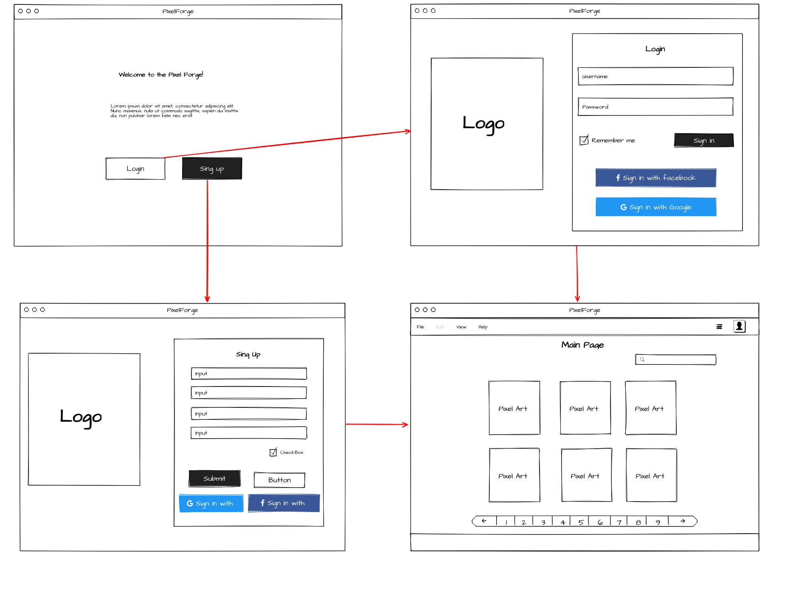

# PixelForge

  

A site for gamedevs and artists to post and consume pixel arts. To be able to find tilesets, sprites, animations, concept arts and more.

Project Pixel Forge. 

## Project Pixel Forge

Tasks: 

Done:

- [x]  Understand how to map many entities to one, in the sense that a user will be the owner of many arts.
- [x]  Implement these entities. Pattern Idea: manege the encrypted file path, so as not to expose details of the API.

- Observation, i think it's not needed encrypt the file path beacouse we gonna
trafic the file over the network.

- [x]  Create the Excpetion Handler, and customized exceptions.
- [x]  Create the endpoint that you manage as Pixel Arts, and decide how you will organize the creation of files, the idea is that an API is the storage, so in the beginning, there is no reason to resort to a third-party storage service.
- [x]  Implements the get functions in the endpoint ( implment the method "get by name") 

To Do: 

- [ ]  Implementes the update functions in the endpoint
- [ ]  Implements the delete function in the endpoint
- [ ]  Writes the tests to the pixel art endpoints, the security endpoints

## Ideas:

- Create a color pallete to the pixel arts when register:
- Creates thubnails to the pixel arts.

How i can open and process images in java: 

- To open the image: 
`BufferedImage image = ImageIO.read(fileOrInputStreamOrURL)`

### WireFrames:
#### Login Flux initial concept:

  

